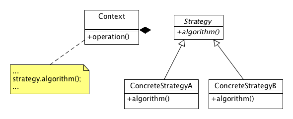
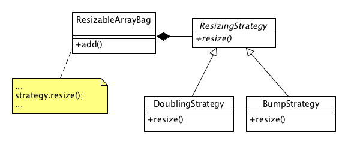
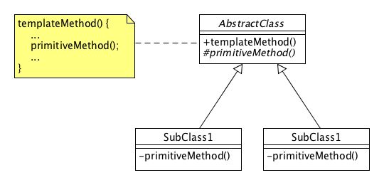

# LAB03 - Dynamic Arrays

In this lab we are introduced to some "Gang of Four" software design patterns. Specifically, upon checkout, this project
already contains an example of the _Strategy Pattern_. In this lab your goal is to _refactor_ this code by eliminating
duplicity with _Template Method_ pattern.

## Due Date

This assignment is due Saturday, February 25, 2023 by 11:59:59 PM.

### Advanced Reading

- General > Files > Class Materials > Setting Up WSL for CSC232.pdf
- [Chapter 3 Array-Based Implementations](https://online.vitalsource.com/reader/books/9780134477473/epubcfi/6/84%5B%3Bvnd.vst.idref%3DP7001011925000000000000000001209%5D!/4/2%5BP7001011925000000000000000001209%5D/2/2%5BP7001011925000000000000000009AA1%5D/7:12%5Bsed%2C%20Im%5D),
  Carrano & Henry textbook
- [Software Design Pattern](https://en.wikipedia.org/wiki/Software_design_pattern)

## Objectives

Upon successful completion of this assignment, the student has

- learned about refactoring
- worked with some Gang of Four Patterns
- Subclassed the ArrayBag into a resizable array bag.

## Background

### Software Design Patterns

A _software design pattern_ is a general, reusable solution to some software design problem;
see [Software Design Pattern](https://en.wikipedia.org/wiki/Software_design_pattern). A group of four developers, Erich
Gamma, Richard Helm, Ralph Johnson and John Vlissides wrote a book cataloging 23 classic design patterns named *
*_Design Patterns: Elements of Reusable Object-Oriented Software_**. This book is a classic and is highly recommended.
The phrase "Gang of Four" refers to the authors of this book.

In cataloging these patterns, the "Gang of Four" (GoF) categorized these patterns into three categories:

1. **Creational** - Creational patterns are ones that create objects for you, rather than having you instantiate objects
   directly. This gives your program more flexibility in deciding which objects need to be created for a given case.
1. **Structural** - These concern class and object composition. They use inheritance to compose interfaces and define
   ways to compose objects to obtain new functionality.
1. **Behavioral** - Most of these design patterns are specifically concerned with communication between objects.

In this lab, we'll explore two _Behavioral_ patterns:

1. **Strategy** - a pattern that allows one of a family of algorithms to be selected on-the-fly at runtime.
1. **Template Method** - a pattern that defines the skeleton of an algorithm as an abstract class, allowing its
   subclasses to provide concrete behavior.

#### Strategy Pattern

The general design of the _Strategy_ pattern is shown below:



In this design we see some _Context_ that holds a reference to some (abstract) _Strategy_. When an `operation()` message
is sent to this context, it delegates to its strategy reference. The type of _Strategy_ that the _Context_ owns can be
changed at runtime so that different strategies can be employed as necessary. In this lab, we construct a particular
_Context_ (namely, `ResizeableArrayBag`) with a particular _Strategy_ reference (e.g., `BumpStrategy`
or `DoublingStrategy` which are both kinds of `ResizingStrategy` instances).

In this lab, we have the following classes playing these roles:



Here, the `add()` and `resize()` operations are not shown with their full method signatures for brevity. The idea is
simple: We are creating a new subclass of the `Bag` interface named `ResizableArrayBag` which uses a resizable array to
store its objects. When we send an `add()` message to some `ResizableArrayBag` that has no room for the new entry, we
call upon our resizing strategy to resize the array of objects. The `DoublingStrategy` will double the size of the array
when we need more room for objects; the `BumpStrategy` will simply bump the size of the array by one element whenever we
need more room.

### Template Method

The general design of the _Template Method_ pattern is shown below:



Here, we have the skeleton of some operation defined in `templateMethod()` which includes calls to one (or
more) `primitiveMethod()` operations. The `primitiveMethod()` operation is a pure virtual operation to be defined in
some subclass.

See `AbstractClass.h`, `SubClass1.h`, `SubClass2.h` and the end of `Demo.cpp` for a demonstration of this pattern. In so
doing, notice that the `primitiveMethod()` is declared as `protected` which effectively makes it private to clients (
i.e., users) of this class but effectively public to subclasses. In the subclasses, we can keep the `protected` scope on
this method, or make it stricter, i.e., make it `private`. In the UML diagram and the sample code, we choose the latter
and make `primitiveMethod()` private in the concrete subclasses of `AbstractClass`. Why do this? Well, the primitive
method is just some step in another method (`templateMethod()`) and as such, we don't want clients to have an effect on
the way the template method operates. It is the subclass, and only the subclass, that should control the way the
template method operates.

## Tasks

Each task in this assignment corresponds to one of the parts of Exercise 19.

1. Task 1: Pull common code up in the class hierarchy
2. Task 2: Declare an abstract method in template method
3. Task 3: Implement abstract method referenced in template method

### Task 1: Declare an abstract method in template method

1. Locate `TODO 1.1` in `ResizingStrategy.h` and follow its instructions

### Task 2: Pull common code up in the class hierarchy
 
1. Locate `TODO 2.1` in the `ResizingStrategy.h` header file and follow its instructions.
2. Locate `TODO 2.2` and replace the assignment to the `size` local variable with a call to the template method declared in task 1.

### Task 3: Implement abstract method referenced in template method

1. Erase the implementations of the resize methods in the concrete strategy classes (i.e., remove the declaration from the header file and the implementation from the source file)
2. Override the new template method declared the first task, i.e., implement it accordingly in the concrete classes
3. When you have completed this task, toggle the `SKIP_TESTING_TASK_3` macro from `TRUE` to `FALSE`.
4. Build and execute the `test_task3` target to test your solution. Alternatively, you can build and execute
   the `All CTest` target.
5. When all the tests for this task pass, commit and push your changes to GitHub.

## Submission Details

Before submitting your assignment, be sure you have pushed all your changes to GitHub. If this is the first time you're
pushing your changes, the push command will look like:

```bash
git push -u origin develop
```

If you've already set up remote tracking (using the `-u origin develop` switch), then all you need to do is type:

```bash
git push
```

As usual, prior to submitting your assignment on Blackboard, be sure that you have committed and pushed your final
changes to GitHub. Once your final changes have been pushed, create a pull request that seeks to merge the changes in
your `develop` branch into your `trunk` branch. Once your pull request has been created, submit the URL of your
assignment _repository_ (i.e., _not_ the URL of the pull request) on the Teams Assignment. Please note: the timestamp of
the submission on Teams is used to assess any late penalties if and when warranted, _not_ the date/time you create your
pull request. **No exceptions will be granted for this oversight**.

### Grading Rubric

This assignment is worth **3 points**.

| Criteria           | Exceeds Expectations         | Meets Expectations                  | Below Expectations                  | Failure                                        |
|--------------------|------------------------------|-------------------------------------|-------------------------------------|------------------------------------------------|
| Pull Request (20%) | Submitted early, correct url | Submitted on-time; correct url      | Incorrect URL                       | No pull request was created or submitted       |
| Code Style (20%)   | Exemplary code style         | Consistent, modern coding style     | Inconsistent coding style           | No style whatsoever or no code changes present |
| Correctness^ (60%) | All unit tests pass          | At least 80% of the unit tests pass | At least 60% of the unit tests pass | Less than 50% of the unit tests pass           |

^ _The Google Test unit runner will calculate the correctness points based purely on the fraction of tests passed_.

### Late Penalty

* In the first 24-hour period following the due date, this lab will be penalized 0.6 point meaning the grading starts at
  2.4 (out of 3 total possible) points.
* In the second 24-hour period following the due date, this lab will be penalized 1.2 points meaning the grading starts
  at 1.8 (out of 3 total possible) points.
* After 48 hours, the assignment will not be graded and thus earns no points, i.e., 0 out of 3 possible points.
